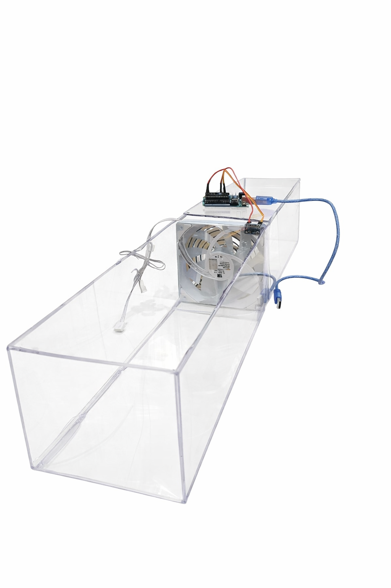
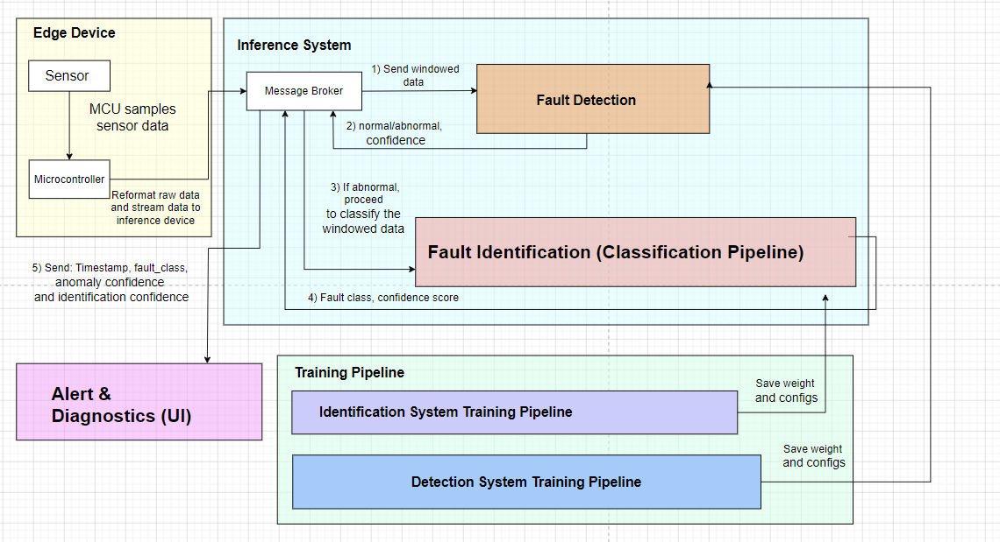

# Fan Fault Detection and Diagnosis (FDD) System

## Setup Emulation 🖥️

Emulated data-center rack setup used for testing and validation:



## System Architecture 🧩

High-level architecture of data flow from sensor collection to interface monitoring:



## Project Description 📌

This repository contains an end-to-end fault detection pipeline for fan systems using accelerometer vibration data.  
It includes:
- data collection from a serial-connected edge device,
- ML training for known-fault classification + unknown detection,
- deployment through a broker process on an edge device, and
- a web interface for monitoring alerts and system state.

By default, trained model artifacts are saved under:
- `fdd_system/ML/weights/`

## Project Showcase 🎬

Showcase links:
1. Video: https://www.youtube.com/watch?v=UvwnPZTXhio&list=PLjFm8PBGO0F8z925_EplnBXtj14-IaxE5&index=10
2. Demo-only: https://drive.google.com/file/d/1_f4fucW7XOBmZQyJUaEBiju7nMfCWydN/view?usp=sharing

## Project Structure 🗂️

- `data_collection/`: scripts to record labeled accelerometer CSV data from serial input.
- `fdd_system/ML/`: training config, training CLI, model components, and inference pipelines.
- `fdd_system/ML/weights/`: trained model artifacts and training summaries.
- `fdd_system/broker/`: edge runtime that reads serial data, runs inference, and posts alerts.
- `interface/backend/`: FastAPI server for alerts, fault periods, and DB access.
- `interface/frontend/`: dashboard UI.
- `experiment/`: notebooks and experimental assets.

## Instructions 🚀

### 1) Collect Data

From the repo root, record data into folders expected by `fdd_system/ML/config.yaml` (example labels: `normal`, `blocked`, `interfere`, `imbalance`, and optional `unknown`):

```bash
mkdir -p experiment/demo_1/{normal,blocked,interfere,imbalance,unknown}
```

Example recording command:

```bash
sh data_collection/run_getData.sh \
  --time 30 \
  --label experiment/demo_1/normal/normal_1.csv \
  --port /dev/ttyACM0 \
  --baud 115200 \
  --fs 800
```

Repeat for each condition and store each recording in its corresponding folder.

### 2) Run Training

Check and update `fdd_system/ML/config.yaml` first:
- `data.dataset_path` should point to your dataset root.
- artifacts are already configured to save under `fdd_system/ML/weights/`.

Run training:

```bash
python -m fdd_system.ML.train --config fdd_system/ML/config.yaml
```

Expected artifacts:
- classifier model: `fdd_system/ML/weights/*.pt` (or selected backend format)
- anomaly detector: `fdd_system/ML/weights/*anomaly_gate*.pt`
- training summary: `fdd_system/ML/weights/end_to_end_training_summary.json`

### 3) Deploy on Edge Device

Run the broker with your trained artifacts and serial device:

```bash
python -m fdd_system.broker.main \
  --port /dev/ttyACM0 \
  --baudrate 115200 \
  --input-format bin \
  --fs-hz 800 \
  --model-path fdd_system/ML/weights/end_to_end_cnn1d_hybrid.pt \
  --model-format torch \
  --embedder auto \
  --preprocessor auto \
  --anomaly-detector-path fdd_system/ML/weights/end_to_end_anomaly_gate.pt \
  --alert-api-url http://127.0.0.1:8001/api/alert \
  --asset-id FAN-01
```

### 4) Run the Interface

Install frontend dependencies once:

```bash
cd interface/frontend
npm install
cd ../..
```

Install backend dependencies once:

```bash
pip install fastapi uvicorn starlette pydantic pymongo python-dotenv
```

Ensure backend/frontend env files are configured:
- `interface/backend/.env`
- `interface/frontend/.env`

Start frontend + backend together:

```bash
cd interface
chmod +x run.sh
./run.sh
```

Open:
- frontend: `http://localhost:5173`
- backend health: `http://127.0.0.1:8001/`
